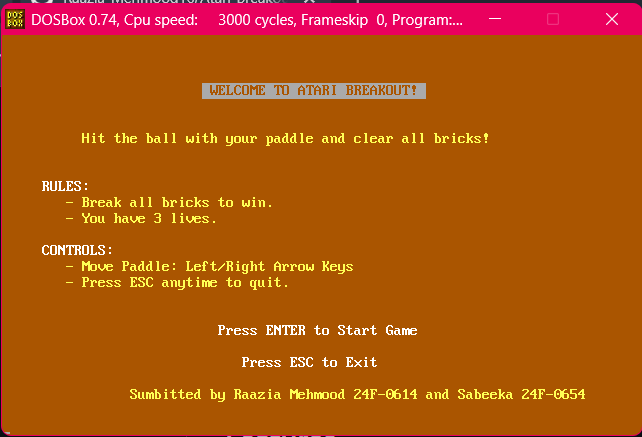
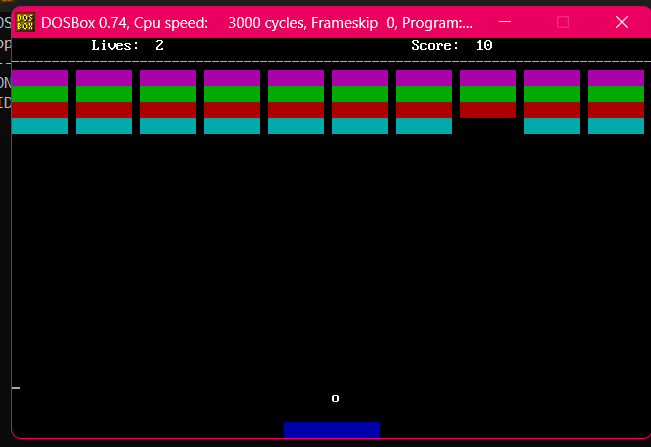
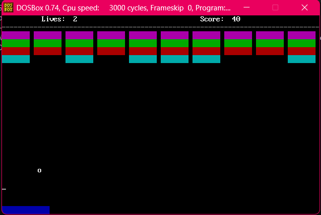
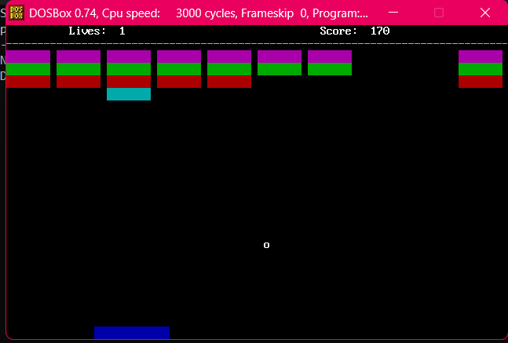
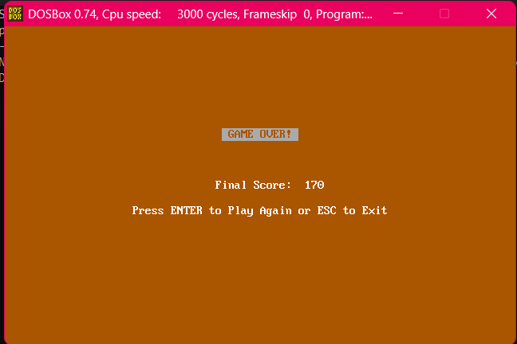

# Atari Breakout Game (x86 Assembly)

## Overview

This project is a recreation of the classic Atari Breakout game developed in x86 Assembly Language. The game runs in DOS text mode and demonstrates low-level programming concepts including direct video memory manipulation, keyboard interrupt handling, collision detection, sound generation, and game loop implementation.

The objective of the game is to destroy all bricks using the ball while preventing the ball from falling below the paddle. The player has three lives to complete the game.

---

## Developers

* Raazia Mehmood (24F-0614)
* Sabeeka (24F-0654)

---

## Features

* Interactive welcome screen
* Paddle movement using arrow keys
* Ball movement with wall collision detection
* Brick collision and destruction
* Score tracking system
* Three-life gameplay system
* Sound effects for:

  * Brick hits
  * Paddle hits
  * Life loss
* Win screen
* Game over screen
* Restart functionality

---

## Controls

| Key         | Action                    |
| ----------- | ------------------------- |
| Left Arrow  | Move paddle left          |
| Right Arrow | Move paddle right         |
| Enter       | Start game / Restart game |
| ESC         | Exit game                 |

---

## Game Rules

1. Break all bricks to win the game.
2. You start with 3 lives.
3. Losing the ball below the paddle costs one life.
4. The game ends when all lives are lost.
5. Destroy all bricks to achieve victory.

---

## Technical Concepts Used

### Direct Video Memory Access

The game writes directly to video memory at address:

0xB800

for rendering game objects and text.

### Keyboard Interrupts

BIOS interrupt:

INT 16h

is used to detect keyboard input.

### Sound Generation

PC speaker ports are used to generate sound effects:

* Port 61h
* Port 42h
* Port 43h

### Collision Detection

The game implements:

* Wall collision detection
* Paddle collision detection
* Brick collision detection

### Game State Management

The game maintains:

* Player score
* Remaining lives
* Brick count
* Ball position and direction
* Paddle position

---

## Program Structure

### Screen Functions

* clrscr
* printstr
* printNum
* welcomeScreen
* winGameScreen
* loseGameScreen

### Brick Functions

* drawBricks
* PrintBrick
* checkBrickCollision

### Paddle Functions

* drawPaddle
* clearPaddle
* checkPaddleCollision

### Ball Functions

* drawBall
* eraseBall
* updateBall
* checkWallCollision

### Utility Functions

* updateScore
* updateLives
* delay
* resetGameState

### Sound Functions

* playBrickSound
* playPaddleSound
* playLifeLostSound

---

## How to Run

### Requirements

* DOSBox
* NASM Assembler

### Assemble

```bash
nasm breakout.asm -f bin -o breakout.com
```

### Run

```bash
breakout.com
```

or execute it inside DOSBox.

---

## Learning Outcomes

This project demonstrates practical implementation of:

* Assembly Language Programming
* Low-Level Memory Management
* BIOS Interrupt Handling
* Game Development Fundamentals
* Collision Detection Algorithms
* Direct Hardware Interaction
* Modular Programming in Assembly

---

## Future Improvements

* Multiple levels
* Increasing difficulty
* High score system
* Improved graphics
* Power-ups
* Different brick types
* Background music

---

## Screenshots

### Welcome Screen



### Gameplay1



### Gameplay2



### Gameplay3



### Game Over Screen




---

## License

This project was developed for educational purposes as part of a Computer Organization and Assembly Language course.

-----

# for better review

